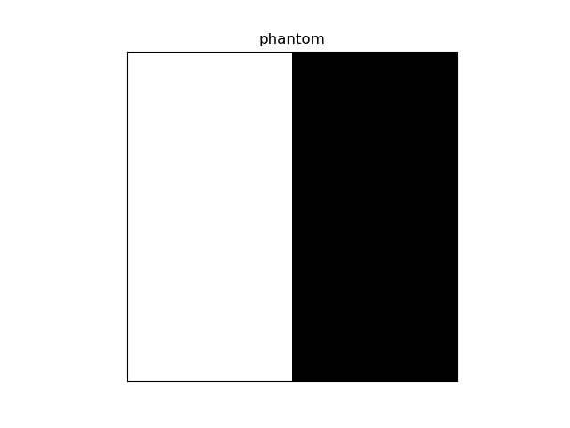
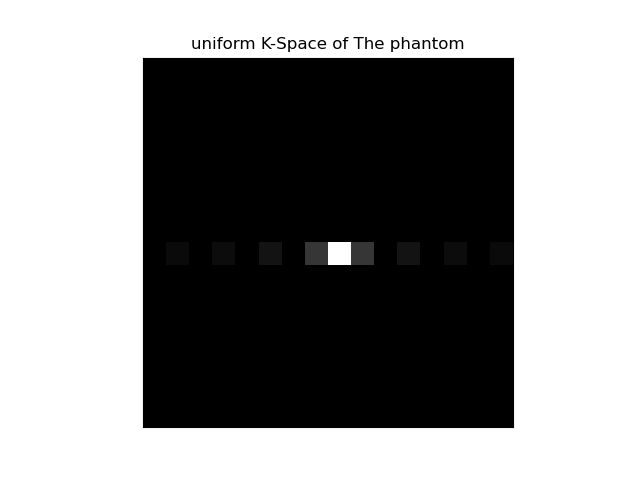
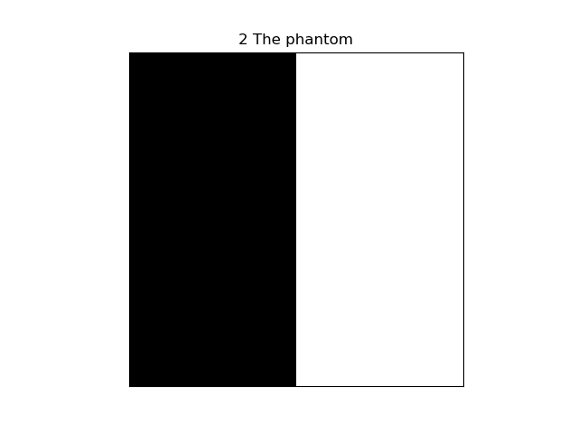

# Programming Assignment 3 
| Submitted to: | Prof/ Inas A. Yassine |
| ----------- | ----------- |
| **By** | - Adel Moustafa |
|     | - Mahmoud Abdelrhman |
|     | - Mohamed Kamal |
|     | - Mohamed Yasser |

# Bulk magnetization vector
There are three used functions to rotate the bulk magnetization vector and plot its trajectory:

**1.Excitation:** It's used to rotate the bulk magnetization  around X_axis and it's trajectory during excitation process.

**2.Relaxation:** It's used to rotate the bulk magnetization and it's trajectory during relaxation process.

**3.Update_line:** It's used to update the plotted data.

In addition to **get_parametesrs()**, used to get parameters by console (Ask to add nonuniformty effect or not  )

We work on 4X4 voxel in our simulation  8 spins represent oil and 8 water .
all  parameters are assumpation to facilitate the simulation 
,but we took into consideraion T1,T2 for oil is shorter than water.
and also T1 is longer  in general 

alo we add frequency encoding and phase encoding ,so each spins will have different freq that shown in simulation.
we have 4 row to fill in K-Space 

This video Simulate Without nonuniformty effect

# Uniform K-Space 
The uniform k-space is calculated using the function **uniform_kspace(img)**
which takes the created phantom by the function **shepp_logan()** and calculates the FFT for the phantom.   

**The Phantom.**

**The Phantom's uniform k-space. **

** inverse of uniform k-space. **

# Non-uniform K-Space
The non-uniform k-space is calculated using the function **non_uniform_kspace(phantom)** which takes the created phantom using the function **shepp_logan()** and calculates the non-uniform FFT for it, which simulates the effect of the non-uniform external magnetic field.

**The Phantom's non-uniform k-space.**

